<div align="center">
  <p><code>OPEN SOURCE · AGENT-NATIVE · EVIDENCE-FIRST</code></p>
  <h1>Aperture</h1>
  <p><strong>Ask the company. See the evidence.</strong></p>
  <p>The fast, relationship-aware context layer for people and agents.</p>

  [](https://github.com/rootsec1/company-brain/actions/workflows/ci.yml)
  [](https://github.com/rootsec1/company-brain/stargazers)
  [](LICENSE)
  [](https://bun.sh)
  [](https://nextjs.org)
  [](https://modelcontextprotocol.io)
</div>

<br />

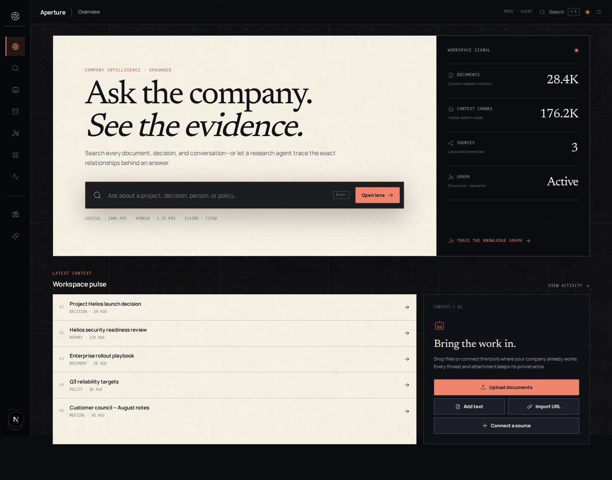

Aperture turns documents, messages, connected apps, attachments, and the relationships between them into one searchable evidence system. Search paints immediately. Research answers stay attached to their sources. Agents get the same bounded, read-only context through MCP.

The interface is built as a **split lens**: a warm, readable answer surface beside a live evidence map. Exact source relationships remain visible; semantic graph context enriches the answer without replacing provenance.

> **Pre-1.0:** Aperture is built for a single trusted workspace and intentionally has no application login yet. The default Compose deployment binds only to localhost.

## Why Aperture

Most RAG stacks flatten a company into anonymous chunks. Aperture preserves the shape of the work: who said it, which thread it belongs to, what was attached, which version replaced it, and exactly where a claim came from.

| Principle | What Aperture does |
|---|---|
| **Fast by default** | Typo-tolerant lexical results paint first; vector fusion and bounded reranking upgrade progressively |
| **Evidence over vibes** | Company-specific claims resolve to stable document and chunk citations |
| **Relationships first** | Threads, attachments, authors, folders, links, mentions, and versions are preserved before semantic enrichment |
| **Graph when it helps** | Exact PostgreSQL edges combine with asynchronous LightRAG context; graph work never blocks search |
| **Agent-native** | Six bounded read-only tools power the product agent and the Streamable HTTP MCP server |
| **Bring the work in** | A dynamic Composio catalog, optimized source profiles, cursors, triggers, and attachment hydration |
| **One-command local stack** | `docker compose up --build`, with three environment variables at most |

## Product tour

<table>
  <tr>
    <td colspan="2">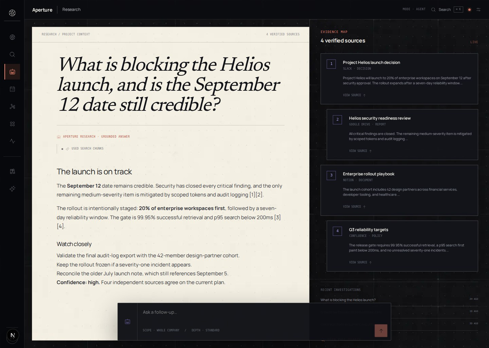<br /><sub><b>Research is a split lens.</b> Read the grounded answer on a calm paper surface while verified source cards remain open beside it.</sub></td>
  </tr>
  <tr>
    <td width="50%">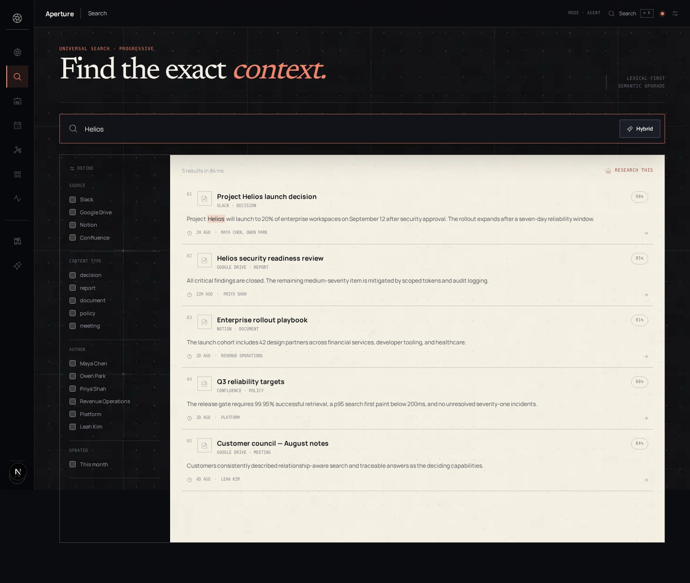<br /><sub><b>Search.</b> A keyboard-first evidence ledger with facets, highlighted snippets, and progressive ranking.</sub></td>
    <td width="50%">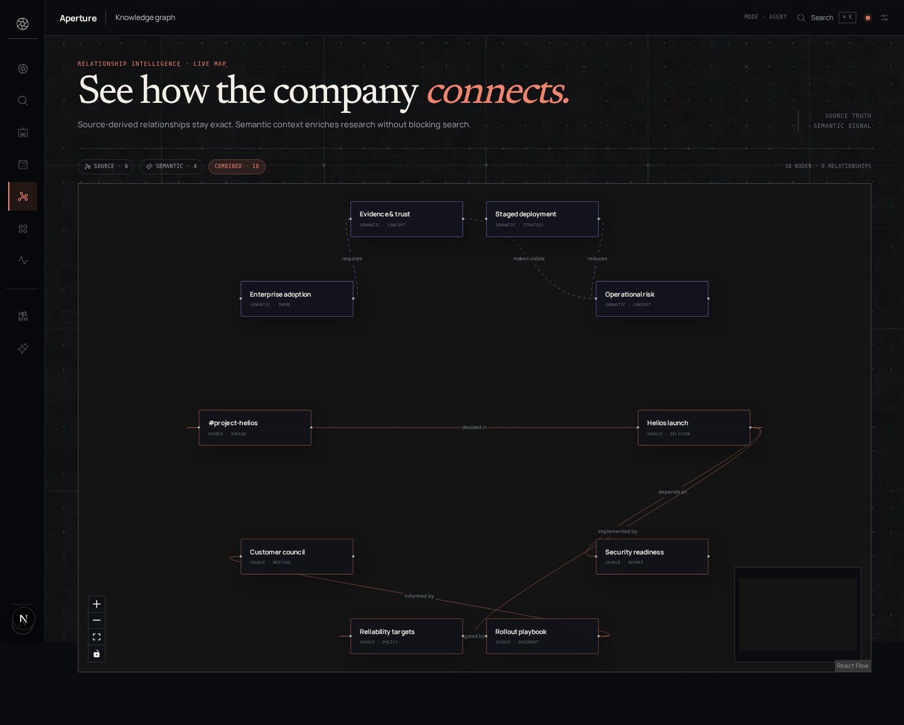<br /><sub><b>Graph.</b> Source-derived edges and semantic signals remain visibly distinct and directly explorable.</sub></td>
  </tr>
  <tr>
    <td width="50%">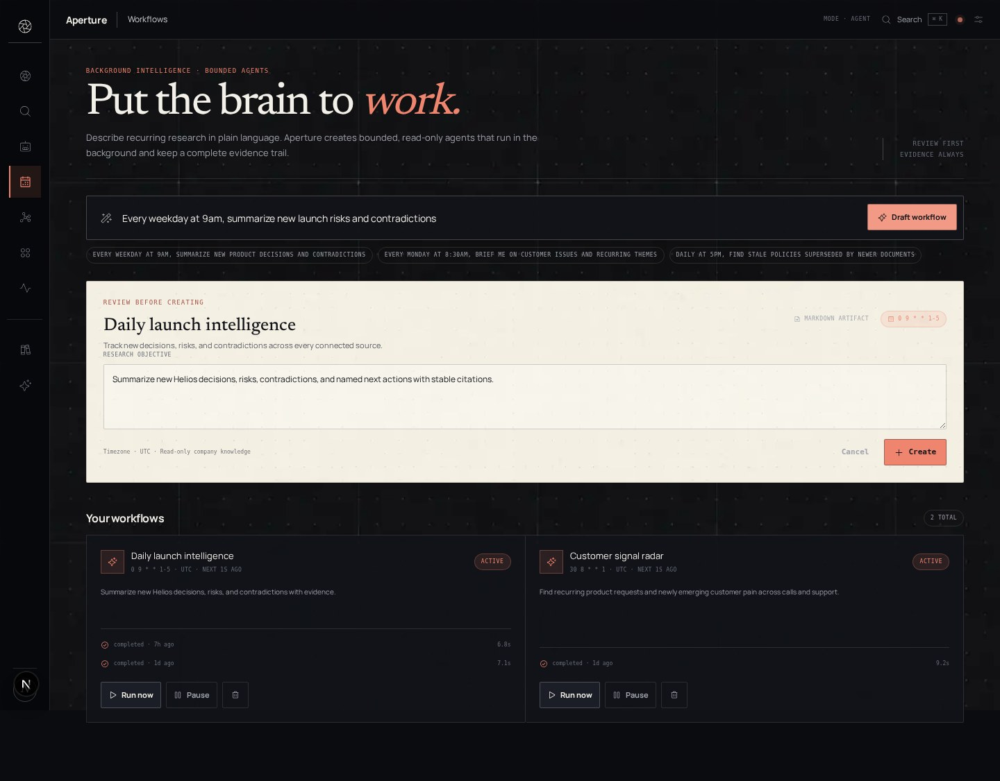<br /><sub><b>Workflows.</b> Turn plain-language research requests into bounded recurring agents with review-first controls.</sub></td>
    <td width="50%">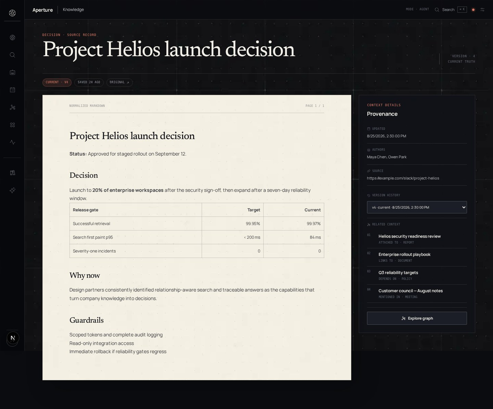<br /><sub><b>Documents.</b> Normalized Markdown, provenance, version history, and related context share one inspection surface.</sub></td>
  </tr>
</table>

<details>
  <summary><strong>Explore more product surfaces</strong></summary>
  <br />
  <table>
    <tr>
      <td width="50%">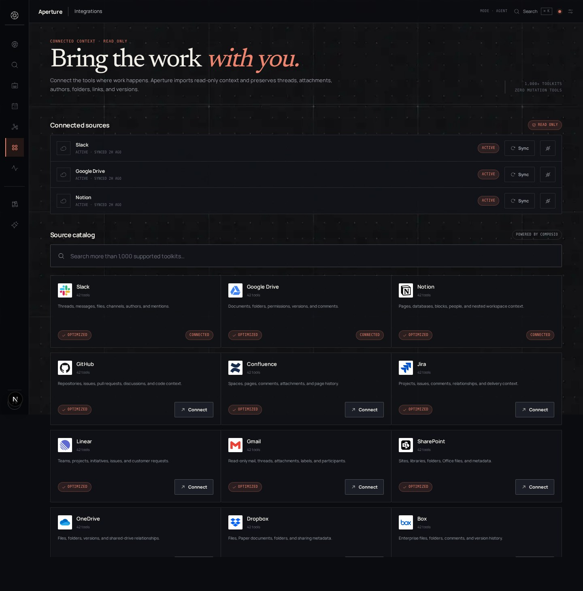<br /><sub><b>Integrations.</b> Search and connect a broad read-only catalog with sync health at a glance.</sub></td>
      <td width="50%">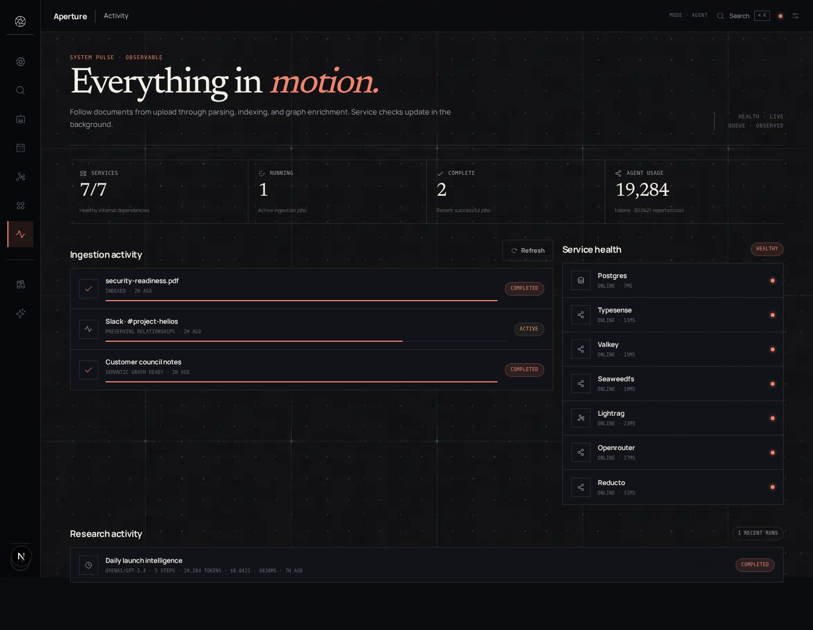<br /><sub><b>Activity.</b> Follow ingestion, indexing, graph enrichment, service health, and agent usage in real time.</sub></td>
    </tr>
    <tr>
      <td width="50%">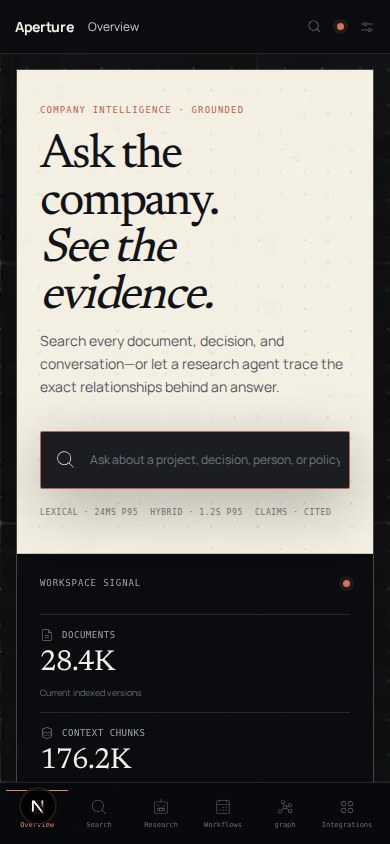<br /><sub><b>Responsive overview.</b> The primary context and ingestion path stay focused on a narrow screen.</sub></td>
      <td width="50%">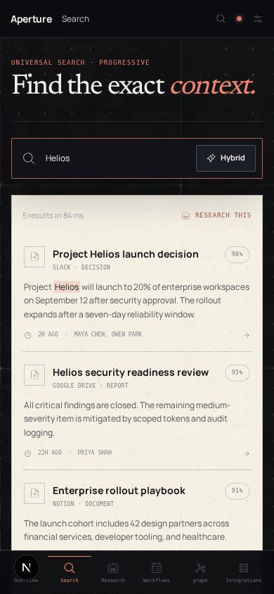<br /><sub><b>Responsive search.</b> Evidence remains scannable and keyboard-ready without collapsing into generic cards.</sub></td>
    </tr>
  </table>
</details>

> Every product screenshot uses deterministic, fictional Project Helios demo data. No connected workspace content or personally identifiable information is included.

## Quick start

You need Docker Engine with Compose and API keys for [OpenRouter](https://openrouter.ai) and [Reducto](https://reducto.ai). Composio is optional.

```bash
git clone https://github.com/rootsec1/company-brain.git
cd company-brain
cp .env.example .env
# Add OPENROUTER_API_KEY and REDUCTO_API_KEY to .env
docker compose up --build
```

Open <http://localhost:3000>. Bootstrap applies migrations, creates the object bucket and search collection, and seeds the local workspace automatically.

```dotenv
OPENROUTER_API_KEY=
REDUCTO_API_KEY=
COMPOSIO_API_KEY= # optional
```

All non-secret settings—from model IDs and search weights to queue concurrency—live in [`config/consts.json`](config/consts.json).

## Architecture

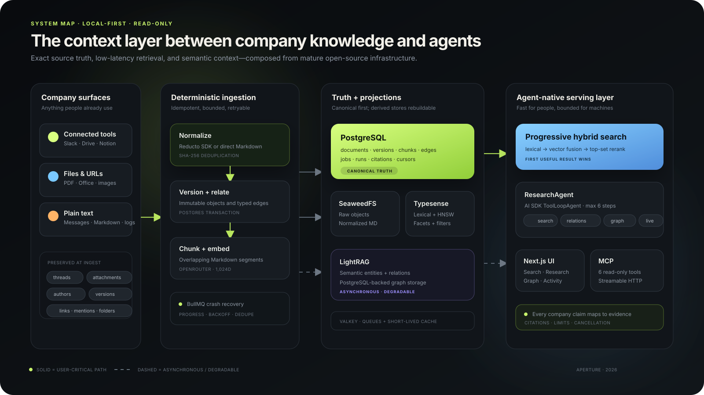

The stack is deliberately compositional: mature open-source systems own solved infrastructure problems, while Aperture owns normalization, relationship fidelity, retrieval policy, and product UX.

| Service | Role |
|---|---|
| Next.js + Bun | Product UI, streaming APIs, MCP, build and test tooling |
| PostgreSQL | Canonical sources, versions, edges, conversations, runs, citations, and costs |
| Typesense | Low-latency lexical and HNSW vector search with facets and rank fusion |
| LightRAG | Incremental semantic entities, relations, and context-only graph retrieval |
| Valkey + BullMQ | Retryable ingestion, sync, graph, and workflow jobs |
| SeaweedFS S3 | Raw binaries and normalized Markdown |
| Reducto SDK | OCR and structured parsing for documents, tables, figures, and page anchors |
| OpenRouter SDKs | Answer, planning, embedding, and reranking models |
| Composio SDK | Read-only connected-source catalog, OAuth, tools, triggers, and downloads |

Read the deeper [architecture](docs/ARCHITECTURE.md) and [operations guide](docs/OPERATIONS.md).

## Retrieval pipeline

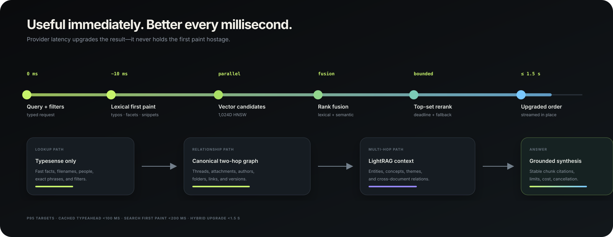

Interactive search never waits for the entire quality pipeline. Lexical results render first. Embedding, fusion, and reranking upgrade the result order within separate deadlines. Agent searches use larger evidence budgets, deterministic two-hop source traversal, and optional LightRAG context.

### Performance snapshot

The checked-in load harness measures the whole HTTP search path. A local production build recently produced the following provider-inclusive results over 30 requests at concurrency 8; hardware, corpus size, and provider region will affect your numbers.

| Path | Observed p95 | Product budget |
|---|---:|---:|
| Cached lexical | 4 ms | < 100 ms |
| Uncached lexical | 24 ms | < 200 ms |
| Hybrid + remote embedding/rerank | 1,221 ms | < 1,500 ms |

Run `bun run load:search` against your own corpus instead of treating these numbers as a universal benchmark.

The default read-only agent tools are:

```text
search_chunks          get_document          find_related
traverse_source_graph  get_graph_context     live_source_search
```

The same tools are exposed through Streamable HTTP at `/mcp` using the official MCP TypeScript SDK.

## Ingest knowledge

```bash
# Markdown or plain text
curl -X POST http://localhost:3000/api/ingest/text \
  -H 'content-type: application/json' \
  -d '{"title":"Launch notes","text":"# Launch\nApproved for October.","kind":"note"}'

# Binary documents; OCR and layout parsing happen asynchronously
curl -X POST http://localhost:3000/api/ingest/files \
  -F 'files=@./strategy.pdf'

# Search
curl -X POST http://localhost:3000/api/search \
  -H 'content-type: application/json' \
  -d '{"query":"What changed in the launch plan?","mode":"hybrid","limit":10}'
```

Binary connector imports use `/api/ingest/composio/files`, retaining the external file ID and its `attached_to` relationship while the ordinary Reducto pipeline parses the bytes.

## Integrations

Add `COMPOSIO_API_KEY` to enable the live toolkit catalog and OAuth connection flow. Aperture ships optimized read profiles for Slack, Google Drive, Notion, GitHub, Confluence, Jira, Linear, Gmail, SharePoint/OneDrive, Dropbox, and Box. Other toolkits use a validated adaptive read recipe and fall back to live lookup when enumeration is unavailable.

External mutation tools are excluded by policy: no create, update, delete, send, comment, post, upload, or reply action is exposed to research agents or MCP clients.

## Development

```bash
bun install --frozen-lockfile
bun run typecheck
bun run test
bun run build
bun run test:e2e
```

Useful deeper checks:

```bash
bun run test:e2e:live  # provider-backed end-to-end journey
bun run load:search    # cached, lexical, and provider-inclusive p95s
bun run eval           # Promptfoo retrieval and grounding suite
bun run eval:graph     # graph/no-graph quality gate
```

Regenerate the documentation gallery from the safe demo fixture with:

```bash
APERTURE_SCREENSHOT_DEMO=1 bun run audit:screenshots docs/assets
```

See [`AGENTS.md`](AGENTS.md) for repository invariants and the full verification ladder, and [`CONTRIBUTING.md`](CONTRIBUTING.md) before sending a change.

## Security and privacy

- The web port binds to `127.0.0.1` by default; infrastructure remains private to Compose.
- AI SDK telemetry records neither inputs nor outputs.
- Provider payloads, indexed company data, `.env`, runtime volumes, traces, and captures are never repository fixtures.
- PostgreSQL and SeaweedFS are the backup boundary; search, queue, and graph stores are derived.
- V1 has no application auth. Put an authenticated reverse proxy in front before any shared deployment.

Please report vulnerabilities privately as described in [`SECURITY.md`](SECURITY.md).

## Community

- [Contributing](CONTRIBUTING.md)
- [Code of Conduct](CODE_OF_CONDUCT.md)
- [Security policy](SECURITY.md)
- [Changelog](CHANGELOG.md)
- [Apache 2.0 license](LICENSE)

<div align="center">
  <sub>Built for teams that want company context to be fast, inspectable, and genuinely useful to agents.</sub>
</div>
